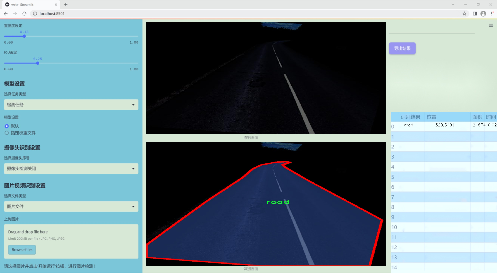
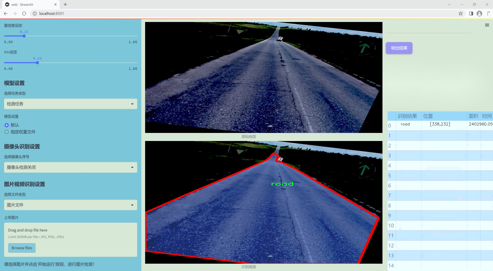
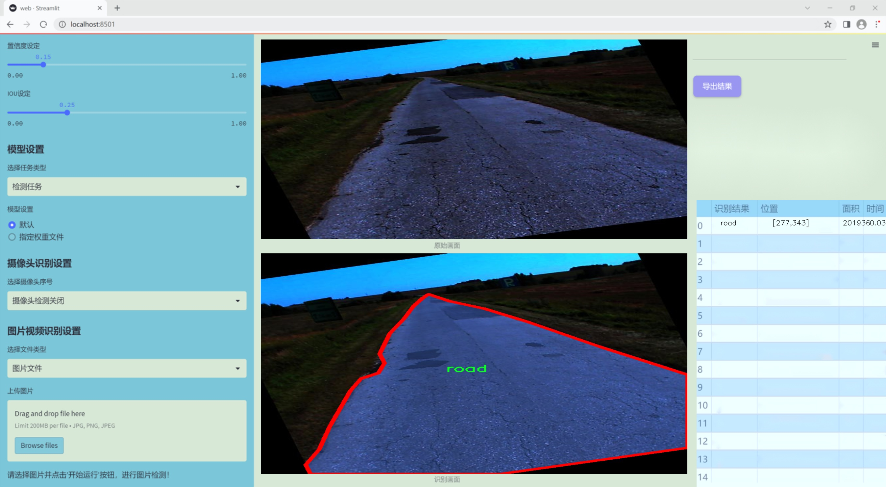
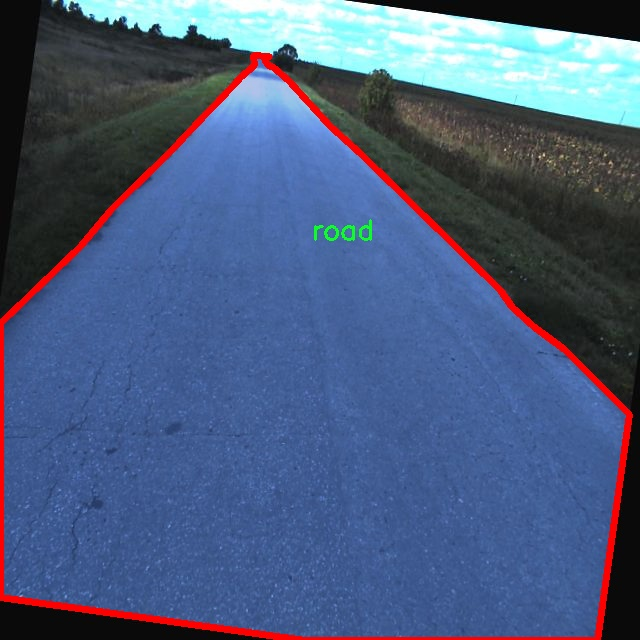
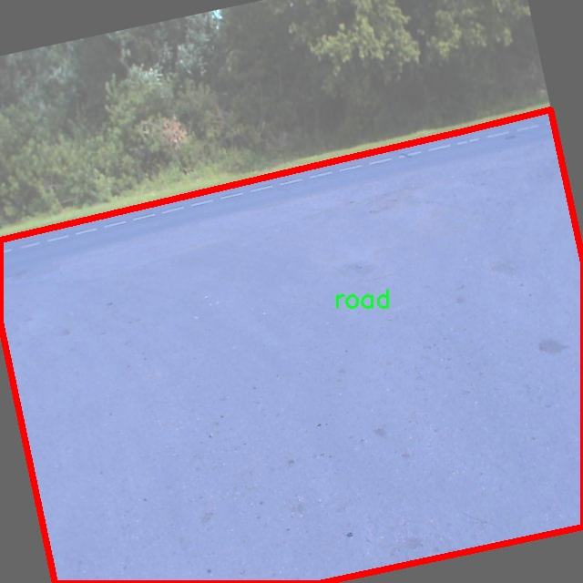
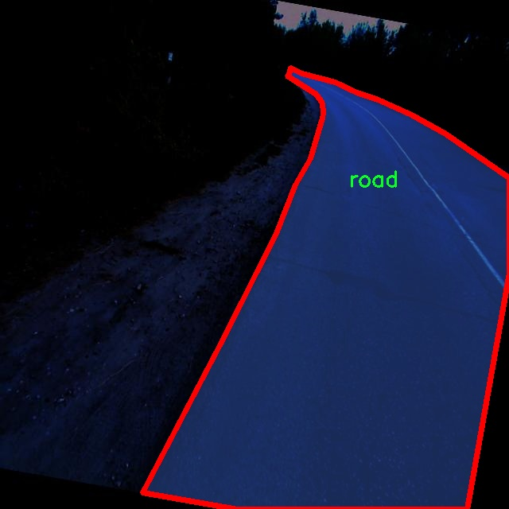
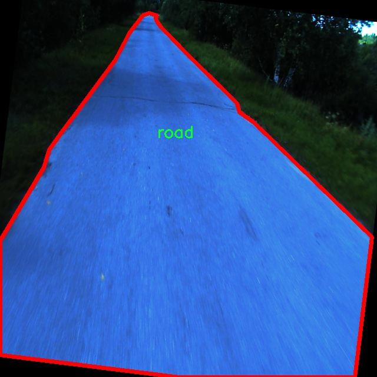
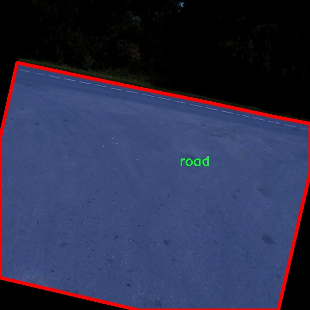

# 改进yolo11-DWR等200+全套创新点大全：道路实例分割系统源码＆数据集全套

### 1.图片效果展示







##### 项目来源 **[人工智能促进会 2024.10.28](https://kdocs.cn/l/cszuIiCKVNis)**

注意：由于项目一直在更新迭代，上面“1.图片效果展示”和“2.视频效果展示”展示的系统图片或者视频可能为老版本，新版本在老版本的基础上升级如下：（实际效果以升级的新版本为准）

  （1）适配了YOLOV11的“目标检测”模型和“实例分割”模型，通过加载相应的权重（.pt）文件即可自适应加载模型。

  （2）支持“图片识别”、“视频识别”、“摄像头实时识别”三种识别模式。

  （3）支持“图片识别”、“视频识别”、“摄像头实时识别”三种识别结果保存导出，解决手动导出（容易卡顿出现爆内存）存在的问题，识别完自动保存结果并导出到tempDir中。

  （4）支持Web前端系统中的标题、背景图等自定义修改。

  另外本项目提供训练的数据集和训练教程,暂不提供权重文件（best.pt）,需要您按照教程进行训练后实现图片演示和Web前端界面演示的效果。

### 2.视频效果展示

[2.1 视频效果展示](https://www.bilibili.com/video/BV1BUSWYwEsZ/)

### 3.背景

研究背景与意义

随着城市化进程的加快，交通管理与道路安全问题日益凸显。道路实例分割作为计算机视觉领域的重要研究方向，旨在对道路场景中的不同元素进行精确识别与分割，为智能交通系统的建设提供基础支持。近年来，深度学习技术的迅猛发展，尤其是目标检测与实例分割领域的突破，为道路实例分割的实现提供了新的可能性。YOLO（You Only Look Once）系列模型因其高效的实时处理能力和较好的检测精度，成为了实例分割任务中的热门选择。

本研究旨在基于改进的YOLOv11模型，构建一个高效的道路实例分割系统。该系统将利用一个包含100幅图像的道路实例分割数据集进行训练与测试。尽管数据集的规模相对较小，但通过数据增强技术和模型的改进，仍然可以提取出有效的特征信息，提升模型的分割性能。道路场景的复杂性和多样性，使得准确的实例分割不仅依赖于数据量的大小，更需要模型在特征提取与处理上的创新。

此外，随着自动驾驶技术的不断发展，对道路环境的实时感知能力提出了更高的要求。通过实现精准的道路实例分割，可以为自动驾驶系统提供更为可靠的环境理解，进而提高行车安全性和效率。因此，本研究不仅具有理论价值，还具有重要的实际应用意义。通过对YOLOv11模型的改进与优化，期望能够在道路实例分割领域取得更为显著的成果，为智能交通和自动驾驶技术的发展贡献力量。

### 4.数据集信息展示

##### 4.1 本项目数据集详细数据（类别数＆类别名）

nc: 1
names: ['road']


该项目为【图像分割】数据集，请在【训练教程和Web端加载模型教程（第三步）】这一步的时候按照【图像分割】部分的教程来训练

##### 4.2 本项目数据集信息介绍

本项目数据集信息介绍

本项目所使用的数据集名为“final_road”，旨在为改进YOLOv11的道路实例分割系统提供高质量的训练数据。该数据集专注于道路的识别与分割，涵盖了多种不同环境下的道路图像，以确保模型在实际应用中的鲁棒性和准确性。数据集中包含的类别数量为1，具体类别为“road”，这意味着所有的标注均围绕道路这一单一对象展开。通过聚焦于这一特定类别，数据集能够提供更为精细的特征学习，进而提升模型在道路实例分割任务中的表现。

“final_road”数据集的构建过程经过精心设计，确保所收集的图像涵盖了多样化的场景，包括城市道路、乡村道路、不同天气条件下的道路以及不同时间段的光照变化。这种多样性不仅有助于模型学习到道路的多种表现形式，还能增强其在不同环境下的适应能力。此外，数据集中的图像经过严格的标注和审核，确保每一张图像中的道路区域都被准确地分割和标识。这一过程的严谨性为后续的模型训练奠定了坚实的基础。

在训练过程中，YOLOv11将利用“final_road”数据集中的图像和相应的标注信息，进行特征提取和模型优化。通过对大量道路实例的学习，模型将能够更好地理解道路的形状、纹理和上下文信息，从而实现更高效的实例分割。最终，期望通过这一数据集的应用，提升YOLOv11在道路实例分割任务中的性能，使其在智能交通、自动驾驶等领域的应用更加精准和可靠。











### 5.全套项目环境部署视频教程（零基础手把手教学）

[5.1 所需软件PyCharm和Anaconda安装教程（第一步）](https://www.bilibili.com/video/BV1BoC1YCEKi/?spm_id_from=333.999.0.0&vd_source=bc9aec86d164b67a7004b996143742dc)


[5.2 安装Python虚拟环境创建和依赖库安装视频教程（第二步）](https://www.bilibili.com/video/BV1ZoC1YCEBw?spm_id_from=333.788.videopod.sections&vd_source=bc9aec86d164b67a7004b996143742dc)

### 6.改进YOLOv11训练教程和Web_UI前端加载模型教程（零基础手把手教学）

[6.1 改进YOLOv11训练教程和Web_UI前端加载模型教程（第三步）](https://www.bilibili.com/video/BV1BoC1YCEhR?spm_id_from=333.788.videopod.sections&vd_source=bc9aec86d164b67a7004b996143742dc)


按照上面的训练视频教程链接加载项目提供的数据集，运行train.py即可开始训练



     Epoch   gpu_mem       box       obj       cls    labels  img_size
     1/200     20.8G   0.01576   0.01955  0.007536        22      1280: 100%|██████████| 849/849 [14:42<00:00,  1.04s/it]
               Class     Images     Labels          P          R     mAP@.5 mAP@.5:.95: 100%|██████████| 213/213 [01:14<00:00,  2.87it/s]
                 all       3395      17314      0.994      0.957      0.0957      0.0843

     Epoch   gpu_mem       box       obj       cls    labels  img_size
     2/200     20.8G   0.01578   0.01923  0.007006        22      1280: 100%|██████████| 849/849 [14:44<00:00,  1.04s/it]
               Class     Images     Labels          P          R     mAP@.5 mAP@.5:.95: 100%|██████████| 213/213 [01:12<00:00,  2.95it/s]
                 all       3395      17314      0.996      0.956      0.0957      0.0845

     Epoch   gpu_mem       box       obj       cls    labels  img_size
     3/200     20.8G   0.01561    0.0191  0.006895        27      1280: 100%|██████████| 849/849 [10:56<00:00,  1.29it/s]
               Class     Images     Labels          P          R     mAP@.5 mAP@.5:.95: 100%|███████   | 187/213 [00:52<00:00,  4.04it/s]
                 all       3395      17314      0.996      0.957      0.0957      0.0845


###### [项目数据集下载链接](https://kdocs.cn/l/cszuIiCKVNis)

### 7.原始YOLOv11算法讲解


其实到了YOLOV11 基本创新点就不太多了，主要就是大家互相排列组合复用不同的网络模块、损失函数和样本匹配策略，需要注意YOLO V5、V8 V11
都是1个公司的，其余的个人建议看看V8的，剩下的了解就好。

V11支持多种视觉任务：物体检测、实例分割、图像分类、姿态估计和定向物体检测（OBB）。

##### YOLOv11
基本和YOLOV8同源，甚至git目前都是1个，部分代码注释还是YOLOV8的，所以建议先看我写的YOLOV8相关博客，对比YOLOV8主要涉及到：

*backbone 中的使用C2f模块 变为 c3k2 模块。

*backbone 中的最后一层（sppf层）后增加了C2PSA模块。

*head 解耦头中的分类检测头两个Conv 变为 DWConv。

整体技术而言：

*backbone 使用了C2K2模块+最后SPPF模块级联C2PSA模块；

*neck 使用PAN结构，并且里面也使用C3K2模块；

*head使用了anchor-free + Decoupled-head，其中回归头使用正常的卷积，分类头使用DWConv；

*损失函数使用了分类BCE、回归CIOU + VFL的组合；

*框匹配策略由静态匹配改为了Task-Aligned Assigner匹配方式；

*训练策略没有提及，其中YOLOV8可以参考如下最后 10 个 epoch 关闭 Mosaic 的操作、训练总 epoch 数从 300 提升到了 500。

##### 主要思路


配置文件：[ultralytics/ultralytics/cfg/models/11/yolo11.yaml at main ·
ultralytics/ultralytics ·
GitHub](https://github.com/ultralytics/ultralytics/blob/main/ultralytics/cfg/models/11/yolo11.yaml
"ultralytics/ultralytics/cfg/models/11/yolo11.yaml at main ·
ultralytics/ultralytics · GitHub")

解析函数：[ultralytics/ultralytics/nn/tasks.py at main · ultralytics/ultralytics ·
GitHub](https://github.com/ultralytics/ultralytics/blob/main/ultralytics/nn/tasks.py#L934
"ultralytics/ultralytics/nn/tasks.py at main · ultralytics/ultralytics ·
GitHub")


##### 具体细节

##### input

输入要求以及预处理，可选项比较多，可以参考这个配置文件：[ultralytics/ultralytics/cfg/default.yaml at main
· ultralytics/ultralytics ·
GitHub](https://github.com/ultralytics/ultralytics/blob/main/ultralytics/cfg/default.yaml
"ultralytics/ultralytics/cfg/default.yaml at main · ultralytics/ultralytics ·
GitHub") 的Hyperparameters 部分。

基础输入仍然为640*640。预处理就是熟悉的letterbox（根据参数配置可以为不同的缩放填充模式，主要用于resize到640）+
转换rgb、chw、int8(0-255)->float（0-1），注意没有归一化操作。需要注意的是作者实现的mosaic和网上看到的不同，对比如下图（左边网上版本，右边是YOLO的实现）。并且作者添加了在最后10轮关闭mosaic增强（YOLOV8开始支持，具体原因个人的经验如我的这篇文章：yolov5
mosaic相关，关闭参数在 Train settings 部分的close_mosaic 选项）


##### backbone

主干网络以及改进

这里不去特意强调对比YOLOv5、V8等等的改进，因为各个系列都在疯狂演进，个人认为没必要花费时间看差异，着重看看一些比较重要的模块即可。源代码：

大多数模块：[ultralytics/ultralytics/nn/modules/block.py at main ·
ultralytics/ultralytics ·
GitHub](https://github.com/ultralytics/ultralytics/blob/main/ultralytics/nn/modules/block.py
"ultralytics/ultralytics/nn/modules/block.py at main · ultralytics/ultralytics
· GitHub")

head 部分：[ultralytics/ultralytics/nn/modules/head.py at main ·
ultralytics/ultralytics ·
GitHub](https://github.com/ultralytics/ultralytics/blob/main/ultralytics/nn/modules/head.py
"ultralytics/ultralytics/nn/modules/head.py at main · ultralytics/ultralytics
· GitHub")

串联模块构造网络：[ultralytics/ultralytics/nn/tasks.py at main ·
ultralytics/ultralytics ·
GitHub](https://github.com/ultralytics/ultralytics/blob/main/ultralytics/nn/tasks.py
"ultralytics/ultralytics/nn/tasks.py at main · ultralytics/ultralytics ·
GitHub")

##### 1）CBS 模块（后面叫做Conv）

就是pytorch 自带的conv + BN +SiLU，这里对应上面的配置文件的Conv 的 args 比如[64, 3, 2] 就是 conv2d
的c2=64、k=3、 s =2、c1 自动为上一层参数、p 为自动计算，真实需要计算scales 里面的with 和 max_channels 缩放系数。

这里连续使用两个3*3卷积stride为2的CBS模块直接横竖各降低了4倍分辨率（整体变为原来1/16）。这个还是比较猛的，敢在如此小的感受野下连续两次仅仅用一层卷积就下采样,当然作为代价它的特征图还是比较厚的分别为16、32。


    
    
        class Conv(nn.Module):
        """Standard convolution with args(ch_in, ch_out, kernel, stride, padding, groups, dilation, activation)."""
    
        default_act = nn.SiLU()  # default activation
    
        def __init__(self, c1, c2, k=1, s=1, p=None, g=1, d=1, act=True):
            """Initialize Conv layer with given arguments including activation."""
            super().__init__()
            self.conv = nn.Conv2d(c1, c2, k, s, autopad(k, p, d), groups=g, dilation=d, bias=False)
            self.bn = nn.BatchNorm2d(c2)
            self.act = self.default_act if act is True else act if isinstance(act, nn.Module) else nn.Identity()
    
        def forward(self, x):
            """Apply convolution, batch normalization and activation to input tensor."""
            return self.act(self.bn(self.conv(x)))
    
        def forward_fuse(self, x):
            """Perform transposed convolution of 2D data."""
            return self.act(self.conv(x))

##### 2）c3k2 模块

##### Bottleneck

有两种结构，需要参数shortcut和两个conv的宽度是否相同来控制。

##### C3 & C3K

都是CSP bottleneck module with 3 convolutions, C3 代表3个卷积层，
K代表其中bottleneck中的卷积核为支持自定义，其实这里c3k作者使用的默认的3*3卷积核也就等同于使用c3(c3是3*3卷积核)。

##### c2f & c3k2

其实也就是仿照YOLOv7 的ELAN
结构，通过更多的分支夸层链接，丰富了模型的梯度流。C3K2模块其实就是C2F模块转变出来的，它代码中有一个设置，就是当c3k这个参数为FALSE的时候，C3K2模块就是C2F模块，也就是说它的Bottleneck是普通的Bottleneck；反之当它为true的时候，将Bottleneck模块替换成C3K模块。模块中存在
Split 等操作对特定硬件部署没有之前那么友好了。需要针对自己的硬件进行测试看对最终推理速度的影响。

可视化关系如下，这里需要注意配置文件中的参数，比如21行[-1, 2, C3k2, [512, False, 0.25]]
512代表宽度、false代表是否使用shortcut、0.25代表c2f的宽度缩放。也就是第一个Conv的输出宽度。


源代码如下:

    
    
    class Bottleneck(nn.Module):
        """Standard bottleneck."""
    
        def __init__(self, c1, c2, shortcut=True, g=1, k=(3, 3), e=0.5):
            """Initializes a standard bottleneck module with optional shortcut connection and configurable parameters."""
            super().__init__()
            c_ = int(c2 * e)  # hidden channels
            self.cv1 = Conv(c1, c_, k[0], 1)
            self.cv2 = Conv(c_, c2, k[1], 1, g=g)
            self.add = shortcut and c1 == c2
    
        def forward(self, x):
            """Applies the YOLO FPN to input data."""
            return x + self.cv2(self.cv1(x)) if self.add else self.cv2(self.cv1(x))
    
    class C3(nn.Module):
        """CSP Bottleneck with 3 convolutions."""
    
        def __init__(self, c1, c2, n=1, shortcut=True, g=1, e=0.5):
            """Initialize the CSP Bottleneck with given channels, number, shortcut, groups, and expansion values."""
            super().__init__()
            c_ = int(c2 * e)  # hidden channels
            self.cv1 = Conv(c1, c_, 1, 1)
            self.cv2 = Conv(c1, c_, 1, 1)
            self.cv3 = Conv(2 * c_, c2, 1)  # optional act=FReLU(c2)
            self.m = nn.Sequential(*(Bottleneck(c_, c_, shortcut, g, k=((1, 1), (3, 3)), e=1.0) for _ in range(n)))
    
        def forward(self, x):
            """Forward pass through the CSP bottleneck with 2 convolutions."""
            return self.cv3(torch.cat((self.m(self.cv1(x)), self.cv2(x)), 1))
    
    class C3k(C3):
        """C3k is a CSP bottleneck module with customizable kernel sizes for feature extraction in neural networks."""
    
        def __init__(self, c1, c2, n=1, shortcut=True, g=1, e=0.5, k=3):
            """Initializes the C3k module with specified channels, number of layers, and configurations."""
            super().__init__(c1, c2, n, shortcut, g, e)
            c_ = int(c2 * e)  # hidden channels
            # self.m = nn.Sequential(*(RepBottleneck(c_, c_, shortcut, g, k=(k, k), e=1.0) for _ in range(n)))
            self.m = nn.Sequential(*(Bottleneck(c_, c_, shortcut, g, k=(k, k), e=1.0) for _ in range(n)))
    
    class C2f(nn.Module):
        """Faster Implementation of CSP Bottleneck with 2 convolutions."""
    
        def __init__(self, c1, c2, n=1, shortcut=False, g=1, e=0.5):
            """Initializes a CSP bottleneck with 2 convolutions and n Bottleneck blocks for faster processing."""
            super().__init__()
            self.c = int(c2 * e)  # hidden channels
            self.cv1 = Conv(c1, 2 * self.c, 1, 1)
            self.cv2 = Conv((2 + n) * self.c, c2, 1)  # optional act=FReLU(c2)
            self.m = nn.ModuleList(Bottleneck(self.c, self.c, shortcut, g, k=((3, 3), (3, 3)), e=1.0) for _ in range(n))
    
        def forward(self, x):
            """Forward pass through C2f layer."""
            y = list(self.cv1(x).chunk(2, 1))
            y.extend(m(y[-1]) for m in self.m)
            return self.cv2(torch.cat(y, 1))
    
        def forward_split(self, x):
            """Forward pass using split() instead of chunk()."""
            y = list(self.cv1(x).split((self.c, self.c), 1))
            y.extend(m(y[-1]) for m in self.m)
            return self.cv2(torch.cat(y, 1))
    
    class C3k2(C2f):
        """Faster Implementation of CSP Bottleneck with 2 convolutions."""
    
        def __init__(self, c1, c2, n=1, c3k=False, e=0.5, g=1, shortcut=True):
            """Initializes the C3k2 module, a faster CSP Bottleneck with 2 convolutions and optional C3k blocks."""
            super().__init__(c1, c2, n, shortcut, g, e)
            self.m = nn.ModuleList(
                C3k(self.c, self.c, 2, shortcut, g) if c3k else Bottleneck(self.c, self.c, shortcut, g) for _ in range(n)
            )

##### 3）sppf 模块

对比spp，将简单的并行max pooling 改为串行+并行的方式。对比如下（左边是SPP，右边是SPPF）：


    
    
        class SPPF(nn.Module):
        # Spatial Pyramid Pooling - Fast (SPPF) layer for YOLOv5 by Glenn Jocher
        def __init__(self, c1, c2, k=5):  # equivalent to SPP(k=(5, 9, 13))
            super().__init__()
            c_ = c1 // 2  # hidden channels
            self.cv1 = Conv(c1, c_, 1, 1)
            self.cv2 = Conv(c_ * 4, c2, 1, 1)
            self.m = nn.MaxPool2d(kernel_size=k, stride=1, padding=k // 2)
    
        def forward(self, x):
            x = self.cv1(x)
            with warnings.catch_warnings():
                warnings.simplefilter('ignore')  # suppress torch 1.9.0 max_pool2d() warning
                y1 = self.m(x)
                y2 = self.m(y1)
                return self.cv2(torch.cat((x, y1, y2, self.m(y2)), 1))

##### 4）C2PSA 模块

C2PSA它结合了PSA(Pointwise Spatial
Attention)块，用于增强特征提取和注意力机制。下面的图建议从左到右看，这样才能更有条理的理解，其实PSA个人感觉就是仿着VIT
的Attention来做的，是把输入C2PSA的特征图的h*w 看做VIT 的path数（也可以理解为NLP中token 个数），特征图的channel
数看做VIT特征维度（CNN的宽度，或者理解为NLP中token
编码后的特征维度），然后计算出QKV（这里需要注意第四幅图的QKV是值，不是操作，所以标注成了圆角矩形，这里是为了大家好理解），这里的Attention其实是在h*w维度计算空间Attention，个人感觉是强制给了全局感受野，并且并联了一个3*3的深度可分离卷积的单空间部分，就是仅在每一个特征图上进行3*3卷积，具体实现是通过pytorch
conv2d 的
group参数设置为特征图的通道数。特别的关于Conv的参数分别为：输入通道数、输出通道数、卷积核尺寸、pad尺寸、group数、是否有激活函数（默认silu）。图中的最后一幅省略了一些细节，可以参考源码。

注意区别C2fPSA，C2fPSA才是对 C2f 模块的扩展，通过在标准 C2f 模块中引入 PSA
块，C2fPSA实现了更强大的注意力机制，从而提高了模型对重要特征的捕捉能力。作者实现了该模块但最终没有使用。


涉及的源码：

    
    
    class Attention(nn.Module):
        """
        Attention module that performs self-attention on the input tensor.
    
        Args:
            dim (int): The input tensor dimension.
            num_heads (int): The number of attention heads.
            attn_ratio (float): The ratio of the attention key dimension to the head dimension.
    
        Attributes:
            num_heads (int): The number of attention heads.
            head_dim (int): The dimension of each attention head.
            key_dim (int): The dimension of the attention key.
            scale (float): The scaling factor for the attention scores.
            qkv (Conv): Convolutional layer for computing the query, key, and value.
            proj (Conv): Convolutional layer for projecting the attended values.
            pe (Conv): Convolutional layer for positional encoding.
        """
    
        def __init__(self, dim, num_heads=8, attn_ratio=0.5):
            """Initializes multi-head attention module with query, key, and value convolutions and positional encoding."""
            super().__init__()
            self.num_heads = num_heads
            self.head_dim = dim // num_heads
            self.key_dim = int(self.head_dim * attn_ratio)
            self.scale = self.key_dim**-0.5
            nh_kd = self.key_dim * num_heads
            h = dim + nh_kd * 2
            self.qkv = Conv(dim, h, 1, act=False)
            self.proj = Conv(dim, dim, 1, act=False)
            self.pe = Conv(dim, dim, 3, 1, g=dim, act=False)
    
        def forward(self, x):
            """
            Forward pass of the Attention module.
    
            Args:
                x (torch.Tensor): The input tensor.
    
            Returns:
                (torch.Tensor): The output tensor after self-attention.
            """
            B, C, H, W = x.shape
            N = H * W
            qkv = self.qkv(x)
            q, k, v = qkv.view(B, self.num_heads, self.key_dim * 2 + self.head_dim, N).split(
                [self.key_dim, self.key_dim, self.head_dim], dim=2
            )
    
            attn = (q.transpose(-2, -1) @ k) * self.scale
            attn = attn.softmax(dim=-1)
            x = (v @ attn.transpose(-2, -1)).view(B, C, H, W) + self.pe(v.reshape(B, C, H, W))
            x = self.proj(x)
            return x
    
    class PSABlock(nn.Module):
        """
        PSABlock class implementing a Position-Sensitive Attention block for neural networks.
    
        This class encapsulates the functionality for applying multi-head attention and feed-forward neural network layers
        with optional shortcut connections.
    
        Attributes:
            attn (Attention): Multi-head attention module.
            ffn (nn.Sequential): Feed-forward neural network module.
            add (bool): Flag indicating whether to add shortcut connections.
    
        Methods:
            forward: Performs a forward pass through the PSABlock, applying attention and feed-forward layers.
    
        Examples:
            Create a PSABlock and perform a forward pass
            >>> psablock = PSABlock(c=128, attn_ratio=0.5, num_heads=4, shortcut=True)
            >>> input_tensor = torch.randn(1, 128, 32, 32)
            >>> output_tensor = psablock(input_tensor)
        """
    
        def __init__(self, c, attn_ratio=0.5, num_heads=4, shortcut=True) -> None:
            """Initializes the PSABlock with attention and feed-forward layers for enhanced feature extraction."""
            super().__init__()
    
            self.attn = Attention(c, attn_ratio=attn_ratio, num_heads=num_heads)
            self.ffn = nn.Sequential(Conv(c, c * 2, 1), Conv(c * 2, c, 1, act=False))
            self.add = shortcut
    
        def forward(self, x):
            """Executes a forward pass through PSABlock, applying attention and feed-forward layers to the input tensor."""
            x = x + self.attn(x) if self.add else self.attn(x)
            x = x + self.ffn(x) if self.add else self.ffn(x)
            return x
        
    class C2PSA(nn.Module):
        """
        C2PSA module with attention mechanism for enhanced feature extraction and processing.
    
        This module implements a convolutional block with attention mechanisms to enhance feature extraction and processing
        capabilities. It includes a series of PSABlock modules for self-attention and feed-forward operations.
    
        Attributes:
            c (int): Number of hidden channels.
            cv1 (Conv): 1x1 convolution layer to reduce the number of input channels to 2*c.
            cv2 (Conv): 1x1 convolution layer to reduce the number of output channels to c.
            m (nn.Sequential): Sequential container of PSABlock modules for attention and feed-forward operations.
    
        Methods:
            forward: Performs a forward pass through the C2PSA module, applying attention and feed-forward operations.
    
        Notes:
            This module essentially is the same as PSA module, but refactored to allow stacking more PSABlock modules.
    
        Examples:
            >>> c2psa = C2PSA(c1=256, c2=256, n=3, e=0.5)
            >>> input_tensor = torch.randn(1, 256, 64, 64)
            >>> output_tensor = c2psa(input_tensor)
        """
    
        def __init__(self, c1, c2, n=1, e=0.5):
            """Initializes the C2PSA module with specified input/output channels, number of layers, and expansion ratio."""
            super().__init__()
            assert c1 == c2
            self.c = int(c1 * e)
            self.cv1 = Conv(c1, 2 * self.c, 1, 1)
            self.cv2 = Conv(2 * self.c, c1, 1)
    
            self.m = nn.Sequential(*(PSABlock(self.c, attn_ratio=0.5, num_heads=self.c // 64) for _ in range(n)))
    
        def forward(self, x):
            """Processes the input tensor 'x' through a series of PSA blocks and returns the transformed tensor."""
            a, b = self.cv1(x).split((self.c, self.c), dim=1)
            b = self.m(b)
            return self.cv2(torch.cat((a, b), 1))

##### 3、neck & head

##### 1）检测头

YOLOV11 Head 部分和YOLOV8是近似的，所以简单对比YOLOV5、V8、V11。


如上面图，上边是YOLOV5 的结构，中是YOLOv8 的结构，下面是YOLOV11 结构

Yolov5: 检测和分类共用一个卷积（coupled head）并且是anchor based ,其 卷积输出为（5+N class）*3，其中
5为bbox 四个值（具体代表什么不同版本略有不同，官方git有说明，历史版本见 目标检测算法——YOLOV5 ）+ 一个obj 值
（是否有目标，这个是从YOLO V1 传承下来的，个人感觉有点绕和不合理，并且后面取消），N class 为类别数，3为anchor 的数量，默认是3个。

YOLOv8：检测和分类的卷积是解耦的（decoupled），如中图，上面一条卷积支路是回归框，框的特征图channel为4*regmax，关于这个regmax
后面我们详细的解释,并不是anchor；分类的channel 为类别数。

YOLOV11：检测和分类的卷积是解耦的（decoupled），如右图，上面一条卷积支路是回归框，框的特征图channel为4*regmax，关于这个regmax
后面我们详细的解释,并不是anchor；分类的channel 为类别数，分类使用深度可分离卷积替代常规卷积降低计算量。

源码部分如下

    
    
    class Detect(nn.Module):
        """YOLO Detect head for detection models."""
    
        dynamic = False  # force grid reconstruction
        export = False  # export mode
        end2end = False  # end2end
        max_det = 300  # max_det
        shape = None
        anchors = torch.empty(0)  # init
        strides = torch.empty(0)  # init
    
        def __init__(self, nc=80, ch=()):
            """Initializes the YOLO detection layer with specified number of classes and channels."""
            super().__init__()
            self.nc = nc  # number of classes
            self.nl = len(ch)  # number of detection layers
            self.reg_max = 16  # DFL channels (ch[0] // 16 to scale 4/8/12/16/20 for n/s/m/l/x)
            self.no = nc + self.reg_max * 4  # number of outputs per anchor
            self.stride = torch.zeros(self.nl)  # strides computed during build
            c2, c3 = max((16, ch[0] // 4, self.reg_max * 4)), max(ch[0], min(self.nc, 100))  # channels
            self.cv2 = nn.ModuleList(
                nn.Sequential(Conv(x, c2, 3), Conv(c2, c2, 3), nn.Conv2d(c2, 4 * self.reg_max, 1)) for x in ch
            )
            self.cv3 = nn.ModuleList(
                nn.Sequential(
                    nn.Sequential(DWConv(x, x, 3), Conv(x, c3, 1)),
                    nn.Sequential(DWConv(c3, c3, 3), Conv(c3, c3, 1)),
                    nn.Conv2d(c3, self.nc, 1),
                )
                for x in ch
            )
            self.dfl = DFL(self.reg_max) if self.reg_max > 1 else nn.Identity()
    
            if self.end2end:
                self.one2one_cv2 = copy.deepcopy(self.cv2)
                self.one2one_cv3 = copy.deepcopy(self.cv3)
    
        def forward(self, x):
            """Concatenates and returns predicted bounding boxes and class probabilities."""
            if self.end2end:
                return self.forward_end2end(x)
    
            for i in range(self.nl):
                x[i] = torch.cat((self.cv2[i](x[i]), self.cv3[i](x[i])), 1)
            if self.training:  # Training path
                return x
            y = self._inference(x)
            return y if self.export else (y, x)

因此主要的变化可以认为有三个：（1）coupled head -> decoupled head ；（2）obj 分支消失；（3）anchor
based——> anchor free ; 4) 深度可分离卷积。

（1）coupled head -> decoupled head

这个解耦操作，看YOLO x 的论文，约有1% 的提升。逻辑和实现都比较直观易懂，不再赘述。

（2）obj 分支消失；

这个其实我自己再看YOLO V1 的时候就有疑问，它存在的意义。后来人们发现，其实obj
的在训练和推理过程中存在逻辑不一致性。具体而言（摘自“<https://zhuanlan.zhihu.com/p/147691786>”）

A。用法不一致。训练的时候，分类和质量估计各自训练自个儿的，但测试的时候却又是乘在一起作为NMS score排序的依据，这个操作显然没有end-to-
end，必然存在一定的gap。（个人认为还好，就是两个监督信号）

B。对象不一致。借助Focal
Loss的力量，分类分支能够使得少量的正样本和大量的负样本一起成功训练，但是质量估计通常就只针对正样本训练。那么，对于one-
stage的检测器而言，在做NMS
score排序的时候，所有的样本都会将分类score和质量预测score相乘用于排序，那么必然会存在一部分分数较低的“负样本”的质量预测是没有在训练过程中有监督信号的，对于大量可能的负样本，他们的质量预测是一个未定义行为。这就很有可能引发这么一个情况：一个分类score相对低的真正的负样本，由于预测了一个不可信的极高的质量score，而导致它可能排到一个真正的正样本（分类score不够高且质量score相对低）的前面。问题一如图所示：


（3）anchor based——> anchor free

这里主要涉及怎么定义回归内容以及如何匹配GT框的问题。也就是如下：

##### 2）匹配策略

A。回归的内容当前版本就是回归的lftp四个值（这四个值是距离匹配到的anchor 点的距离值！不是图片的绝对位置）。后面推理阶段通过
dist2bbox函数转换为需要的格式：

[
https://github.com/ultralytics/ultralytics/blob/cc3c774bde86ffce694d202b7383da6cc1721c1b/ultralytics/nn/modules.py#L378](https://github.com/ultralytics/ultralytics/blob/cc3c774bde86ffce694d202b7383da6cc1721c1b/ultralytics/nn/modules.py#L378
"  
 https://github.com/ultralytics/ultralytics/blob/cc3c774bde86ffce694d202b7383da6cc1721c1b/ultralytics/nn/modules.py#L378")

[
https://github.com/ultralytics/ultralytics/blob/cc3c774bde86ffce694d202b7383da6cc1721c1b/ultralytics/yolo/utils/tal.py#L196](https://github.com/ultralytics/ultralytics/blob/cc3c774bde86ffce694d202b7383da6cc1721c1b/ultralytics/yolo/utils/tal.py#L196
"  
 https://github.com/ultralytics/ultralytics/blob/cc3c774bde86ffce694d202b7383da6cc1721c1b/ultralytics/yolo/utils/tal.py#L196")。

    
    
       def dist2bbox(distance, anchor_points, xywh=True, dim=-1):
        """Transform distance(ltrb) to box(xywh or xyxy)."""
        lt, rb = torch.split(distance, 2, dim)
        x1y1 = anchor_points - lt
        x2y2 = anchor_points + rb
        if xywh:
            c_xy = (x1y1 + x2y2) / 2
            wh = x2y2 - x1y1
            return torch.cat((c_xy, wh), dim)  # xywh bbox
        return torch.cat((x1y1, x2y2), dim)  # xyxy bbox

##### B.匹配策略

YOLOv5 采用静态的匹配策略，V8采用了动态的TaskAlignedAssigner，其余常见的动态匹配还有： YOLOX 的 simOTA、TOOD
的 TaskAlignedAssigner 和 RTMDet 的 DynamicSoftLabelAssigner。


TaskAligned使用分类得分和IoU的高阶组合来衡量Task-Alignment的程度。使用上面公式来对每个实例计算Anchor-level
的对齐程度：s 和 u 分别为分类得分和 IoU 值，α 和 β 为权重超参。t 可以同时控制分类得分和IoU 的优化来实现 Task-
Alignment，可以引导网络动态的关注于高质量的Anchor。采用一种简单的分配规则选择训练样本：对每个实例，选择m个具有最大t值的Anchor作为正样本，选择其余的Anchor作为负样本。然后，通过损失函数(针对分类与定位的对齐而设计的损失函数)进行训练。

代码地址：[ultralytics/ultralytics/yolo/utils/tal.py at
c0c0c138c12699807ff9446f942cb3bd325d670b · ultralytics/ultralytics ·
GitHub](https://github.com/ultralytics/ultralytics/blob/c0c0c138c12699807ff9446f942cb3bd325d670b/ultralytics/yolo/utils/tal.py#L56
"ultralytics/ultralytics/yolo/utils/tal.py at
c0c0c138c12699807ff9446f942cb3bd325d670b · ultralytics/ultralytics · GitHub")

默认参数如下（当前版本这些超参没有提供修改的接口，如需修改需要在源码上进行修改）：


##### 4、loss function

损失函数设计

Loss 计算包括 2 个分支： 分类和回归分支，没有了之前的 objectness 分支。

分类分支依然采用 BCE Loss。回归分支使用了 Distribution Focal Loss（DFL Reg_max默认为16）+ CIoU
Loss。3 个 Loss
采用一定权重比例加权即可（默认如下：<https://github.com/ultralytics/ultralytics/blob/main/ultralytics/yolo/configs/default.yaml#L83>）。


这里重点介绍一下DFL损失。目前被广泛使用的bbox表示可以看作是对bbox方框坐标建模了单一的狄拉克分布。但是在复杂场景中，一些检测对象的边界并非十分明确。如下图左面所示，对于滑板左侧被水花模糊，引起对左边界的预测分布是任意而扁平的，对右边界的预测分布是明确而尖锐的。对于这个问题，有学者提出直接回归一个任意分布来建模边界框，使用softmax实现离散的回归，将狄拉克分布的积分形式推导到一般形式的积分形式来表示边界框。


狄拉克分布可以认为在一个点概率密度为无穷大，其他点概率密度为0，这是一种极端地认为离散的标签时绝对正确的。


因为标签是一个离散的点，如果把标签认为是绝对正确的目标，那么学习出的就是狄拉克分布，概率密度是一条尖锐的竖线。然而真实场景，物体边界并非是十分明确的，因此学习一个宽范围的分布更为合理。我们需要获得的分布虽然不再像狄拉克分布那么极端（只存在标签值），但也应该在标签值附近。因此学者提出Distribution
Focal
Loss损失函数，目的让网络快速聚焦到标签附近的数值，是标签处的概率密度尽量大。思想是使用交叉熵函数，来优化标签y附近左右两个位置的概率，是网络分布聚焦到标签值附近。如下公式。Si
是网络的sigmod 输出（因为真是是多分类，所以是softmax），yi 和 yi+1 是上图的区间顺序，y是label
值。

具体而言，针对我们将DFL的超参数Reg_max 设置为16的情况下：

A。训练阶段：我们以回归left为例：目标的label 转换为ltrb后，y = （ left - 匹配到的anchor 中心点 x 坐标）/
当前的下采样倍数，假设求得3.2。那么i 就应该为3，yi = 3 ,yi+1 = 4。

B。推理阶段：因为没有label，直接将16个格子进行积分（离散变量为求和，也就是期望）结果就是最终的坐标偏移量（再乘以下采样倍数+
匹配到的anchor的对应坐标）


DFL的实现方式其实就是一个卷积：[ultralytics/ultralytics/nn/modules.py at
cc3c774bde86ffce694d202b7383da6cc1721c1b · ultralytics/ultralytics ·
GitHub](https://github.com/ultralytics/ultralytics/blob/cc3c774bde86ffce694d202b7383da6cc1721c1b/ultralytics/nn/modules.py#L67
"ultralytics/ultralytics/nn/modules.py at
cc3c774bde86ffce694d202b7383da6cc1721c1b · ultralytics/ultralytics · GitHub")

NOTE：作者代码中的超参数Reg_max是写死的——16，并且代码内部做了强制截断到16，如果要修改需要修改源码，如果你的输入是640，最大下采样到20*20，那么16是够用的，如果输入没有resize或者超过了640一定要自己设置这个Reg_max参数，否则如果目标尺寸还大，将无法拟合到这个偏移量。
比如1280*1280的图片，目标1280*960，最大下采样32倍，1280/32/2=20 > 16(除以2是因为是一半的偏移量)，超过了dfl
滑板右侧那个图的范围。至于为什么叫focal
loss的变体，有兴趣看一下这个<https://zhuanlan.zhihu.com/p/357415257>和<https://zhuanlan.zhihu.com/p/147691786>就可以，这里不再赘述是因为，如果先看这些，很容易犯晕，反而抓不住DFL
我认为的重点（离散的分布形式）

    
    
        class DFL(nn.Module):
        # Integral module of Distribution Focal Loss (DFL) proposed in Generalized Focal Loss https://ieeexplore.ieee.org/document/9792391
        def __init__(self, c1=16):
            super().__init__()
            self.conv = nn.Conv2d(c1, 1, 1, bias=False).requires_grad_(False)
            x = torch.arange(c1, dtype=torch.float)
            self.conv.weight.data[:] = nn.Parameter(x.view(1, c1, 1, 1))
            self.c1 = c1
    
        def forward(self, x):
            b, c, a = x.shape  # batch, channels, anchors
            return self.conv(x.view(b, 4, self.c1, a).transpose(2, 1).softmax(1)).view(b, 4, a)
            # return self.conv(x.view(b, self.c1, 4, a).softmax(1)).view(b, 4, a)


### 8.200+种全套改进YOLOV11创新点原理讲解

#### 8.1 200+种全套改进YOLOV11创新点原理讲解大全

由于篇幅限制，每个创新点的具体原理讲解就不全部展开，具体见下列网址中的改进模块对应项目的技术原理博客网址【Blog】（创新点均为模块化搭建，原理适配YOLOv5~YOLOv11等各种版本）

[改进模块技术原理博客【Blog】网址链接](https://gitee.com/qunmasj/good)


#### 8.2 精选部分改进YOLOV11创新点原理讲解

###### 这里节选部分改进创新点展开原理讲解(完整的改进原理见上图和[改进模块技术原理博客链接](https://gitee.com/qunmasj/good)【如果此小节的图加载失败可以通过CSDN或者Github搜索该博客的标题访问原始博客，原始博客图片显示正常】
### 深度学习基础
卷积神经网络通过使用具有共享参数的卷积运算显著降低了模型的计算开销和复杂性。在LeNet、AlexNet和VGG等经典网络的驱动下，卷积神经网络现在已经建立了一个完整的系统，并在深度学习领域形成了先进的卷积神经网络模型。

感受野注意力卷积RFCBAMConv的作者在仔细研究了卷积运算之后获得了灵感。对于分类、目标检测和语义分割任务，一方面，图像中不同位置的对象的形状、大小、颜色和分布是可变的。在卷积操作期间，卷积核在每个感受野中使用相同的参数来提取信息，而不考虑来自不同位置的差分信息。这限制了网络的性能，这已经在最近的许多工作中得到了证实。

另一方面，卷积运算没有考虑每个特征的重要性，这进一步影响了提取特征的有效性，并最终限制了模型的性能。此外，注意力机制允许模型专注于重要特征，这可以增强特征提取的优势和卷积神经网络捕获详细特征信息的能力。因此，注意力机制在深度学习中得到了广泛的应用，并成功地应用于各个领域。

通过研究卷积运算的内在缺陷和注意力机制的特点，作者认为现有的空间注意力机制从本质上解决了卷积运算的参数共享问题，但仍局限于对空间特征的认知。对于较大的卷积核，现有的空间注意力机制并没有完全解决共享参数的问题。此外，他们无法强调感受野中每个特征的重要性，例如现有的卷积块注意力模块（CBAM）和 Coordinate注意力（CA）。

因此，[参考该博客提出了一种新的感受野注意力机制（RFA）](https://qunmasj.com)，它完全解决了卷积核共享参数的问题，并充分考虑了感受野中每个特征的重要性。通过RFA设计的卷积运算（RFAConv）是一种新的卷积运算，可以取代现有神经网络中的标准卷积运算。RFAConv通过添加一些参数和计算开销来提高网络性能。

大量关于Imagnet-1k、MS COCO和VOC的实验已经证明了RFAConv的有效性。作为一种由注意力构建的新型卷积运算，它超过了由CAM、CBAM和CA构建的卷积运算（CAMConv、CBAMConv、CAConv）以及标准卷积运算。

此外，为了解决现有方法提取感受野特征速度慢的问题，提出了一种轻量级操作。在构建RFAConv的过程中，再次设计了CA和CBAM的升级版本，并进行了相关实验。作者认为当前的空间注意力机制应该将注意力放在感受野空间特征上，以促进当前空间注意力机制的发展，并再次增强卷积神经网络架构的优势。


### 卷积神经网络架构
出色的神经网络架构可以提高不同任务的性能。卷积运算作为卷积神经网络的一种基本运算，推动了人工智能的发展，并为车辆检测、无人机图像、医学等先进的网络模型做出了贡献。He等人认为随着网络深度的增加，该模型将变得难以训练并产生退化现象，因此他们提出了残差连接来创新卷积神经网络架构的设计。Huang等人通过重用特征来解决网络梯度消失问题，增强了特征信息，他们再次创新了卷积神经网络架构。

通过对卷积运算的详细研究，Dai等人认为，具有固定采样位置的卷积运算在一定程度上限制了网络的性能，因此提出了Deformable Conv，通过学习偏移来改变卷积核的采样位置。在Deformable Conv的基础上，再次提出了Deformable Conv V2和Deformable Conv V3，以提高卷积网络的性能。

Zhang等人注意到，组卷积可以减少模型的参数数量和计算开销。然而，少于组内信息的交互将影响最终的网络性能。1×1的卷积可以与信息相互作用。然而，这将带来更多的参数和计算开销，因此他们提出了无参数的“通道Shuffle”操作来与组之间的信息交互。

Ma等人通过实验得出结论，对于参数较少的模型，推理速度不一定更快，对于计算量较小的模型，推理也不一定更快。经过仔细研究提出了Shufflenet V2。

YOLO将输入图像划分为网格，以预测对象的位置和类别。经过不断的研究，已经提出了8个版本的基于YOLO的目标检测器，如YOLOv11、YOLOv11、YOLOv11等。上述卷积神经网络架构已经取得了巨大的成功。然而，它们并没有解决提取特征过程中的参数共享问题。本文的工作从注意力机制开始，从一个新的角度解决卷积参数共享问题。

### 注意力机制
注意力机制被用作一种提高网络模型性能的技术，使其能够专注于关键特性。注意力机制理论已经在深度学习中建立了一个完整而成熟的体系。Hu等人提出了一种Squeeze-and-Excitation（SE）块，通过压缩特征来聚合全局通道信息，从而获得与每个通道对应的权重。Wang等人认为，当SE与信息交互时，单个通道和权重之间的对应关系是间接的，因此设计了高效通道注Efficient Channel Attention力（ECA），并用自适应kernel大小的一维卷积取代了SE中的全连接（FC）层。Woo等人提出了卷积块注意力模块（CBAM），它结合了通道注意力和空间注意力。作为一个即插即用模块，它可以嵌入卷积神经网络中，以提高网络性能。

尽管SE和CBAM已经提高了网络的性能。Hou等人仍然发现压缩特征在SE和CBAM中丢失了太多信息。因此，他们提出了轻量级Coordinate注意力（CA）来解决SE和CBAM中的问题。Fu等人计了一个空间注意力模块和通道注意力模块，用于扩展全卷积网络（FCN），分别对空间维度和通道维度的语义相关性进行建模。Zhang等人在通道上生成不同尺度的特征图，以建立更有效的通道注意力机制。

本文从一个新的角度解决了标准卷积运算的参数共享问题。这就是将注意力机制结合起来构造卷积运算。尽管目前的注意力机制已经获得了良好的性能，但它们仍然没有关注感受野的空间特征。因此，设计了具有非共享参数的RFA卷积运算，以提高网络的性能。


#### 回顾标准卷积
以标准卷积运算为基础构建卷积神经网络，通过共享参数的滑动窗口提取特征信息，解决了全连接层构建的神经网络的固有问题（即参数数量大、计算开销高）。

设表示输入特征图，其中、和分别表示特征图的通道数、高度和宽度。为了能够清楚地展示卷积核提取特征信息的过程，以为例。提取每个感受野slider的特征信息的卷积运算可以表示如下：


这里，表示在每次卷积slider操作之后获得的值，表示在每个slider内的相应位置处的像素值。表示卷积核，表示卷积核中的参数数量，表示感受野slider的总数。

可以看出，每个slider内相同位置的特征共享相同的参数。因此，标准的卷积运算无法感知不同位置带来的差异信息，这在一定程度上限制了卷积神经网络的性能。

#### 回顾空间注意力
目前，空间注意力机制使用通过学习获得的注意力图来突出每个特征的重要性。与上一节类似，以为例。突出关键特征的空间注意力机制可以简单地表达如下：


这里，表示在加权运算之后获得的值。和分别表示输入特征图和学习注意力图在不同位置的值，是输入特征图的高度和宽度的乘积，表示像素值的总数。一般来说，整个过程可以简单地表示在图1中。


#### 空间注意力与标准卷积
众所周知，将注意力机制引入卷积神经网络可以提高网络的性能。通过标准的卷积运算和对现有空间注意力机制的仔细分析。作者认为空间注意力机制本质上解决了卷积神经网络的固有缺点，即共享参数的问题。

目前，该模型最常见的卷积核大小为1×1和3×3。引入空间注意力机制后用于提取特征的卷积操作是1×1或3×3卷积操作。这个过程可以直观地显示出来。空间注意力机制被插入到1×1卷积运算的前面。通过注意力图对输入特征图进行加权运算（Re-weight“×”），最后通过1×1卷积运算提取感受野的slider特征信息。

整个过程可以简单地表示如下：


 

这里，卷积核仅表示一个参数值。如果将的值作为一个新的卷积核参数，那么有趣的是，通过1×1卷积运算提取特征时的参数共享问题得到了解决。然而，空间注意力机制的传说到此结束。当空间注意力机制被插入到3×3卷积运算的前面时。具体情况如下：


如上所述，如果取的值。作为一种新的卷积核参数，上述方程完全解决了大规模卷积核的参数共享问题。然而，最重要的一点是，卷积核在每个感受野slider中提取将共享部分特征的特征。换句话说，在每个感受野slider内都会有重叠。

经过仔细分析发现，，…，空间注意力图的权重在每个slider内共享。因此，空间注意机制不能解决大规模卷积核共享参数的问题，因为它们不注意感受野的空间特征。在这种情况下，空间注意力机制是有限的。
#### 创新空间注意力与标准卷积
RFA是为了解决空间注意力机制问题而提出的，创新了空间注意力。使用与RFA相同的思想，一系列空间注意力机制可以再次提高性能。RFA设计的卷积运算可以被视为一种轻量级的即插即用模块，以取代标准卷积，从而提高卷积神经网络的性能。因此，作者认为空间注意力机制和标准卷积在未来将有一个新的春天。

感受野的空间特征：

现在给出感受野空间特征的定义。它是专门为卷积核设计的，并根据kernel大小动态生成，如图2所示，以3×3卷积核为例。


在图2中，“空间特征”表示原始特征图，等于空间特征。“感受野空间特征”表示变换后的特征，该特征由每个感受野slider滑块组成，并且不重叠。也就是说，“感受野空间特征”中的每个3×3大小的slider表示提取原始3×3卷积特征时所有感觉野slider的特征。

#### 感受野注意力卷积(RFA):

关于感受野空间特征，该博客的作者提出了感受野注意（RFA），它不仅强调了感受野slider内各种特征的重要性，而且还关注感受野空间特性，以彻底解决卷积核参数共享的问题。感受野空间特征是根据卷积核的大小动态生成的，因此，RFA是卷积的固定组合，不能脱离卷积运算的帮助，卷积运算同时依赖RFA来提高性能。

因此，作者提出了感受野注意力卷积（RFAConv）。具有3×3大小卷积核的RFAConv的总体结构如图3所示。


目前，提取感受野特征最常用的方法速度较慢，因此经过不断探索提出了一种快速的方法，通过分组卷积来取代原来的方法。

具体来说，根据感受野大小，使用相应的组卷积大小来动态生成展开特征。尽管与原始的无参数方法（如Pytorch提供的nn.Unfld()）相比，该方法添加了一些参数，但速度要快得多。

注意：正如在上一节中提到的，当原始的3×3卷积核提取特征时，感受野空间特征中的每个3×3大小的窗口表示所有感受野滑块的特征。但在快速分组卷积提取感受野特征后，由于原始方法太慢，它们会被映射到新的特征中。

最近的一些工作已经证明信息交互可以提高网络性能。类似地，对于RFAConv，与感受野特征信息交互以学习注意力图可以提高网络性能，但与每个感受野特征交互将带来额外的计算开销。为了确保少量的计算开销和参数数量，通过探索使用AvgPool池化每个感受野特征的全局信息，然后通过1×1组卷积运算与信息交互。最后，softmax用于强调感受野特征中每个特征的重要性。通常，RFA的计算可以表示为：


表示分组卷积，表示卷积核的大小，代表规范化，表示输入特征图，是通过将注意力图与变换的感受野空间特征相乘而获得的。

与CBAM和CA不同，RFA可以为每个感受野特征生成注意力图。标准卷积受到卷积神经网络性能的限制，因为共享参数的卷积运算对位置带来的差异信息不敏感。RFA完全可以解决这个问题，具体细节如下：


由于RFA获得的特征图是“调整形状”后不重叠的感受野空间特征，因此通过池化每个感受野滑块的特征信息来学习学习的注意力图。换句话说，RFA学习的注意力图不再在每个感受野slider内共享，并且是有效的。这完全解决了现有的CA和CBAM对大尺寸kernel的注意力机制中的参数共享问题。

同时，RFA给标准卷积核带来了相当大的好处，但调整形状后，特征的高度和宽度是k倍，需要进行k×k的stride卷积运算，才能提取特征信息。RFAConv创新了标准卷积运算。

此外，空间注意力机制将得到升级，因为作者认为现有的空间注意力机制应该专注于感受野空间特征，以提高网络的性能。众所周知，基于自注意力机制的网络模型取得了巨大的成功，因为它解决了卷积参数共享的问题，并对远程信息进行了建模，但基于自注意力机理的方法给模型带来了巨大的计算开销和复杂性。作者认为通过将一些现有空间注意力机制的注意力放在感受野空间特征中，它以轻量级的方式解决了自注意力机制的问题。

答案如下：

将关注感受野空间特征的空间注意力与卷积相匹配，完全解决了卷积参数共享的问题；

当前的空间注意力机制本身具有考虑远距离信息的特点，它们通过全局平均池化或全局最大池化来获得全局信息，这在一定程度上考虑了远距离信息。


为此，作者设计了一种新的CBAM和CA，称为RFACBAM和RFACA，它专注于感受野的空间特征。与RFA类似，使用stride为k的k×k的最终卷积运算来提取特征信息，具体结构如图4和图5所示，将这2种新的卷积方法称为RFCBAMConv和RFCAConv。比较原始的CBAM，使用SE注意力来代替RFCBAM中的CAM。因为这样可以减少计算开销。


此外，在RFCBAM中，通道和空间注意力不是在单独的步骤中执行的，因为通道和空间注意力是同时加权的，从而允许在每个通道上获得的注意力图是不同的。


### 9.系统功能展示

图9.1.系统支持检测结果表格显示

  图9.2.系统支持置信度和IOU阈值手动调节

  图9.3.系统支持自定义加载权重文件best.pt(需要你通过步骤5中训练获得)

  图9.4.系统支持摄像头实时识别

  图9.5.系统支持图片识别

  图9.6.系统支持视频识别

  图9.7.系统支持识别结果文件自动保存

  图9.8.系统支持Excel导出检测结果数据


### 10. YOLOv11核心改进源码讲解

#### 10.1 RFAConv.py

以下是对给定代码的核心部分进行提炼和详细注释的结果：

```python
import torch
import torch.nn as nn
from einops import rearrange

# 定义核心模块
__all__ = ['RFAConv', 'RFCBAMConv', 'RFCAConv']

# 定义 h_sigmoid 激活函数
class h_sigmoid(nn.Module):
    def __init__(self, inplace=True):
        super(h_sigmoid, self).__init__()
        self.relu = nn.ReLU6(inplace=inplace)  # 使用 ReLU6 作为基础

    def forward(self, x):
        return self.relu(x + 3) / 6  # 计算 h_sigmoid

# 定义 h_swish 激活函数
class h_swish(nn.Module):
    def __init__(self, inplace=True):
        super(h_swish, self).__init__()
        self.sigmoid = h_sigmoid(inplace=inplace)  # 使用 h_sigmoid

    def forward(self, x):
        return x * self.sigmoid(x)  # 计算 h_swish

# 定义 RFAConv 模块
class RFAConv(nn.Module):
    def __init__(self, in_channel, out_channel, kernel_size, stride=1):
        super().__init__()
        self.kernel_size = kernel_size

        # 权重生成模块
        self.get_weight = nn.Sequential(
            nn.AvgPool2d(kernel_size=kernel_size, padding=kernel_size // 2, stride=stride),
            nn.Conv2d(in_channel, in_channel * (kernel_size ** 2), kernel_size=1, groups=in_channel, bias=False)
        )
        
        # 特征生成模块
        self.generate_feature = nn.Sequential(
            nn.Conv2d(in_channel, in_channel * (kernel_size ** 2), kernel_size=kernel_size, padding=kernel_size // 2, stride=stride, groups=in_channel, bias=False),
            nn.BatchNorm2d(in_channel * (kernel_size ** 2)),
            nn.ReLU()
        )
        
        # 最终卷积层
        self.conv = nn.Conv2d(in_channel, out_channel, kernel_size=kernel_size, stride=kernel_size)

    def forward(self, x):
        b, c = x.shape[0:2]  # 获取批次大小和通道数
        weight = self.get_weight(x)  # 生成权重
        h, w = weight.shape[2:]  # 获取特征图的高和宽
        
        # 权重归一化
        weighted = weight.view(b, c, self.kernel_size ** 2, h, w).softmax(2)
        feature = self.generate_feature(x).view(b, c, self.kernel_size ** 2, h, w)  # 生成特征
        
        # 加权特征
        weighted_data = feature * weighted
        conv_data = rearrange(weighted_data, 'b c (n1 n2) h w -> b c (h n1) (w n2)', n1=self.kernel_size, n2=self.kernel_size)
        
        return self.conv(conv_data)  # 返回卷积结果

# 定义 RFCBAMConv 模块
class RFCBAMConv(nn.Module):
    def __init__(self, in_channel, out_channel, kernel_size=3, stride=1):
        super().__init__()
        self.kernel_size = kernel_size
        
        # 特征生成模块
        self.generate = nn.Sequential(
            nn.Conv2d(in_channel, in_channel * (kernel_size ** 2), kernel_size, padding=kernel_size // 2, stride=stride, groups=in_channel, bias=False),
            nn.BatchNorm2d(in_channel * (kernel_size ** 2)),
            nn.ReLU()
        )
        
        # 权重生成模块
        self.get_weight = nn.Sequential(nn.Conv2d(2, 1, kernel_size=3, padding=1, bias=False), nn.Sigmoid())
        
        # 通道注意力机制
        self.se = SE(in_channel)
        
        # 最终卷积层
        self.conv = nn.Conv2d(in_channel, out_channel, kernel_size=kernel_size, stride=kernel_size)

    def forward(self, x):
        b, c = x.shape[0:2]
        channel_attention = self.se(x)  # 计算通道注意力
        generate_feature = self.generate(x)  # 生成特征

        h, w = generate_feature.shape[2:]
        generate_feature = generate_feature.view(b, c, self.kernel_size ** 2, h, w)
        
        # 特征重排
        generate_feature = rearrange(generate_feature, 'b c (n1 n2) h w -> b c (h n1) (w n2)', n1=self.kernel_size, n2=self.kernel_size)
        
        # 加权特征
        unfold_feature = generate_feature * channel_attention
        max_feature, _ = torch.max(generate_feature, dim=1, keepdim=True)
        mean_feature = torch.mean(generate_feature, dim=1, keepdim=True)
        
        # 计算接收场注意力
        receptive_field_attention = self.get_weight(torch.cat((max_feature, mean_feature), dim=1))
        conv_data = unfold_feature * receptive_field_attention
        
        return self.conv(conv_data)  # 返回卷积结果

# 定义 RFCAConv 模块
class RFCAConv(nn.Module):
    def __init__(self, inp, oup, kernel_size, stride=1, reduction=32):
        super(RFCAConv, self).__init__()
        self.kernel_size = kernel_size
        
        # 特征生成模块
        self.generate = nn.Sequential(
            nn.Conv2d(inp, inp * (kernel_size ** 2), kernel_size, padding=kernel_size // 2, stride=stride, groups=inp, bias=False),
            nn.BatchNorm2d(inp * (kernel_size ** 2)),
            nn.ReLU()
        )
        
        # 自适应池化
        self.pool_h = nn.AdaptiveAvgPool2d((None, 1))
        self.pool_w = nn.AdaptiveAvgPool2d((1, None))

        mip = max(8, inp // reduction)  # 计算中间通道数

        # 通道压缩层
        self.conv1 = nn.Conv2d(inp, mip, kernel_size=1, stride=1, padding=0)
        self.bn1 = nn.BatchNorm2d(mip)
        self.act = h_swish()  # 使用 h_swish 激活函数
        
        # 通道恢复层
        self.conv_h = nn.Conv2d(mip, inp, kernel_size=1, stride=1, padding=0)
        self.conv_w = nn.Conv2d(mip, inp, kernel_size=1, stride=1, padding=0)
        
        # 最终卷积层
        self.conv = nn.Conv2d(inp, oup, kernel_size, stride=kernel_size)

    def forward(self, x):
        b, c = x.shape[0:2]
        generate_feature = self.generate(x)  # 生成特征
        h, w = generate_feature.shape[2:]
        generate_feature = generate_feature.view(b, c, self.kernel_size ** 2, h, w)
        
        # 特征重排
        generate_feature = rearrange(generate_feature, 'b c (n1 n2) h w -> b c (h n1) (w n2)', n1=self.kernel_size, n2=self.kernel_size)
        
        # 计算通道注意力
        x_h = self.pool_h(generate_feature)
        x_w = self.pool_w(generate_feature).permute(0, 1, 3, 2)

        y = torch.cat([x_h, x_w], dim=2)  # 合并高和宽的特征
        y = self.conv1(y)
        y = self.bn1(y)
        y = self.act(y) 
        
        h, w = generate_feature.shape[2:]
        x_h, x_w = torch.split(y, [h, w], dim=2)
        x_w = x_w.permute(0, 1, 3, 2)

        a_h = self.conv_h(x_h).sigmoid()  # 计算高度注意力
        a_w = self.conv_w(x_w).sigmoid()  # 计算宽度注意力
        
        return self.conv(generate_feature * a_w * a_h)  # 返回加权后的卷积结果
```

### 代码核心部分分析：
1. **激活函数**：`h_sigmoid` 和 `h_swish` 是自定义的激活函数，分别实现了 h-sigmoid 和 h-swish 激活。
2. **RFAConv**：该模块实现了一种基于特征加权的卷积操作，首先通过平均池化和卷积生成权重，然后生成特征并进行加权，最后通过卷积层输出结果。
3. **RFCBAMConv**：该模块在 RFAConv 的基础上增加了通道注意力机制，使用 Squeeze-and-Excitation (SE) 方法来调整通道的重要性，同时计算接收场注意力。
4. **RFCAConv**：该模块进一步结合了通道注意力和空间注意力，使用自适应池化来获取特征的高度和宽度信息，最终通过卷积层输出结果。

以上是对代码的核心部分和功能的详细注释和分析。

该文件定义了几个卷积神经网络模块，主要包括RFAConv、RFCBAMConv和RFCAConv。这些模块利用了不同的卷积操作和注意力机制，以增强特征提取的能力。

首先，文件中引入了必要的库，包括PyTorch和一些自定义的卷积模块。接着，定义了两个激活函数类：h_sigmoid和h_swish。h_sigmoid是一个修改过的sigmoid函数，使用ReLU6进行计算，输出范围在0到1之间。h_swish则是h_sigmoid的组合，返回输入与h_sigmoid输出的乘积。

RFAConv类是一个卷积模块，主要用于生成特征和权重。它的构造函数中定义了两个主要的子模块：get_weight和generate_feature。get_weight使用平均池化和卷积来计算权重，而generate_feature则通过卷积、批归一化和ReLU激活来生成特征。在前向传播中，首先计算输入的权重，然后通过softmax进行归一化，接着生成特征并进行加权，最后将加权后的特征重新排列并通过卷积层输出结果。

SE类实现了Squeeze-and-Excitation（SE）机制，通过全局平均池化和全连接层来计算通道注意力。它的前向传播通过对输入进行池化、全连接层计算和sigmoid激活，输出一个与输入通道数相同的权重。

RFCBAMConv类结合了RFAConv和SE机制，增强了特征提取的能力。它的构造函数中定义了生成特征的卷积层、计算权重的卷积层和SE模块。在前向传播中，首先计算通道注意力，然后生成特征并进行重排列，接着通过最大池化和平均池化计算全局特征，并结合权重进行加权，最后通过卷积层输出结果。

RFCAConv类则是一个结合了空间和通道注意力的卷积模块。它的构造函数中定义了生成特征的卷积层、池化层和几个卷积层。在前向传播中，生成特征后，通过适应性池化计算空间特征，并将其拼接后通过全连接层计算通道注意力，最后结合空间和通道注意力对生成特征进行加权，并通过卷积层输出结果。

整体来看，这个文件实现了一些复杂的卷积操作和注意力机制，旨在提高特征提取的效果，适用于各种计算机视觉任务。

#### 10.2 pkinet.py

以下是代码中最核心的部分，并附上详细的中文注释：

```python
import math
import torch
import torch.nn as nn

class DropPath(nn.Module):
    """实现随机深度（Drop Path）功能的模块，通常用于残差块的主路径中。"""
    
    def __init__(self, drop_prob: float = 0.1):
        super().__init__()
        self.drop_prob = drop_prob  # 设置路径被丢弃的概率

    def forward(self, x: torch.Tensor) -> torch.Tensor:
        """前向传播，应用随机深度"""
        if self.drop_prob == 0. or not self.training:  # 如果不丢弃路径或不在训练模式下
            return x
        keep_prob = 1 - self.drop_prob  # 计算保留概率
        shape = (x.shape[0], ) + (1, ) * (x.ndim - 1)  # 处理不同维度的张量
        random_tensor = keep_prob + torch.rand(shape, dtype=x.dtype, device=x.device)  # 生成随机张量
        output = x.div(keep_prob) * random_tensor.floor()  # 应用丢弃路径
        return output

class ConvFFN(BaseModule):
    """使用卷积模块实现的多层感知机（Feed Forward Network）"""
    
    def __init__(self, in_channels: int, out_channels: Optional[int] = None, hidden_channels_scale: float = 4.0):
        super().__init__()
        out_channels = out_channels or in_channels  # 输出通道数
        hidden_channels = int(in_channels * hidden_channels_scale)  # 隐藏层通道数

        # 定义前馈网络的层
        self.ffn_layers = nn.Sequential(
            nn.LayerNorm(in_channels),  # 归一化
            ConvModule(in_channels, hidden_channels, kernel_size=1, stride=1, padding=0),  # 1x1卷积
            ConvModule(hidden_channels, hidden_channels, kernel_size=3, stride=1, padding=1, groups=hidden_channels),  # 深度卷积
            nn.GELU(),  # 激活函数
            nn.Dropout(0.1),  # Dropout层
            ConvModule(hidden_channels, out_channels, kernel_size=1, stride=1, padding=0),  # 1x1卷积
            nn.Dropout(0.1),  # Dropout层
        )

    def forward(self, x):
        """前向传播，应用前馈网络"""
        return self.ffn_layers(x)

class PKIBlock(BaseModule):
    """多核卷积块（Poly Kernel Inception Block）"""
    
    def __init__(self, in_channels: int, out_channels: Optional[int] = None):
        super().__init__()
        out_channels = out_channels or in_channels
        self.block = InceptionBottleneck(in_channels, out_channels)  # 定义Inception瓶颈
        self.ffn = ConvFFN(out_channels)  # 定义前馈网络
        self.drop_path = DropPath(0.1)  # 定义DropPath层

    def forward(self, x):
        """前向传播，应用Inception块和前馈网络"""
        x = self.block(x)  # 通过Inception块
        x = self.drop_path(x)  # 应用DropPath
        x = self.ffn(x)  # 通过前馈网络
        return x

class PKINet(BaseModule):
    """多核卷积网络（Poly Kernel Inception Network）"""
    
    def __init__(self, arch: str = 'S'):
        super().__init__()
        self.stages = nn.ModuleList()  # 定义网络的各个阶段
        self.stages.append(Stem(3, 32))  # 添加Stem层

        # 添加多个PKIStage
        for _ in range(4):
            self.stages.append(PKIStage(32, 64))  # 示例中使用固定的输入输出通道

    def forward(self, x):
        """前向传播，依次通过各个阶段"""
        for stage in self.stages:
            x = stage(x)  # 通过每个阶段
        return x

def PKINET_T():
    """创建并返回一个小型的多核卷积网络"""
    return PKINet('T')

if __name__ == '__main__':
    model = PKINET_T()  # 实例化模型
    inputs = torch.randn((1, 3, 640, 640))  # 创建输入张量
    res = model(inputs)  # 前向传播
    print(res.size())  # 输出结果的尺寸
```

### 代码说明：
1. **DropPath**: 实现了随机深度的功能，可以在训练时随机丢弃某些路径，以提高模型的泛化能力。
2. **ConvFFN**: 实现了一个简单的前馈网络，使用卷积层和激活函数来处理输入数据。
3. **PKIBlock**: 这是一个多核卷积块，包含了Inception瓶颈和前馈网络，适用于构建更复杂的网络结构。
4. **PKINet**: 这是多核卷积网络的主类，包含多个阶段（如Stem和PKIStage），用于处理输入数据并生成输出。
5. **PKINET_T**: 用于创建一个特定架构的多核卷积网络实例。

该代码主要用于构建一个基于多核卷积的深度学习模型，适用于图像处理等任务。

这个程序文件 `pkinet.py` 实现了一个名为 PKINet 的深度学习模型，主要用于图像处理任务。该模型的设计灵感来源于多核卷积（Poly Kernel Convolution）和注意力机制，结合了多种卷积层和激活函数，以提高特征提取的能力。

首先，文件导入了一些必要的库，包括 `torch` 和 `torch.nn`，以及一些可能来自其他库的模块（如 `mmcv` 和 `mmengine`），用于构建卷积模块和初始化权重。接着，定义了一些辅助函数和类。

`drop_path` 函数实现了随机深度（Stochastic Depth）技术，通过一定概率随机丢弃某些路径，增强模型的泛化能力。`DropPath` 类是该函数的封装，便于在模型中使用。

`autopad` 函数用于自动计算卷积操作的填充，以确保输出的空间维度与输入相同。`make_divisible` 函数则用于确保通道数可以被指定的数值整除，这在构建模型时很重要。

接下来，定义了一些用于张量维度转换的类，如 `BCHW2BHWC` 和 `BHWC2BCHW`，这些类用于在不同的通道格式之间转换。`GSiLU` 类实现了一种全局的 Sigmoid 门控线性单元（Gated Linear Unit），用于增强模型的非线性表达能力。

`CAA` 类实现了上下文锚点注意力机制，通过对输入特征进行平均池化和卷积操作，生成注意力因子，帮助模型更好地聚焦于重要特征。

`ConvFFN` 类实现了一个多层感知机，使用卷积模块构建，包含多个卷积层和激活函数，旨在增强特征的表达能力。`Stem` 和 `DownSamplingLayer` 类分别实现了模型的初始层和下采样层，用于处理输入图像和减少特征图的空间维度。

`InceptionBottleneck` 类实现了一个瓶颈结构，结合了多个不同大小的卷积核，通过并行的卷积操作提取多尺度特征。`PKIBlock` 类则是将这些组件组合在一起，形成一个完整的多核卷积块。

`PKIStage` 类实现了一个模型的阶段，包含多个 `PKIBlock`，并在每个阶段中进行下采样。`PKINet` 类是整个网络的实现，包含多个阶段，并提供了不同的网络架构设置（如 T、S、B 版本），以适应不同的任务需求。

在 `PKINet` 的构造函数中，定义了网络的各个阶段和初始化权重的方式。`forward` 方法实现了前向传播，返回指定的输出特征图。

最后，文件提供了三个函数 `PKINET_T`、`PKINET_S` 和 `PKINET_B`，用于创建不同版本的 PKINet 模型。在 `__main__` 块中，创建了一个 PKINET_T 模型的实例，并对随机生成的输入数据进行了前向传播，输出了每个阶段的特征图大小。

总体来说，这个文件实现了一个复杂的深度学习模型，结合了多种先进的技术，旨在提高图像处理任务的性能。

#### 10.3 transformer.py

以下是代码中最核心的部分，并附上详细的中文注释：

```python
import torch
import torch.nn as nn
from functools import partial

# 引入自定义的归一化模块
from .prepbn import RepBN, LinearNorm
# 引入变换器编码器层
from ..modules.transformer import TransformerEncoderLayer

# 定义可导出的模块
__all__ = ['AIFI_RepBN']

# 定义线性归一化的部分函数
ln = nn.LayerNorm
linearnorm = partial(LinearNorm, norm1=ln, norm2=RepBN, step=60000)

class TransformerEncoderLayer_RepBN(TransformerEncoderLayer):
    def __init__(self, c1, cm=2048, num_heads=8, dropout=0, act=..., normalize_before=False):
        # 初始化父类
        super().__init__(c1, cm, num_heads, dropout, act, normalize_before)
        
        # 使用自定义的线性归一化
        self.norm1 = linearnorm(c1)
        self.norm2 = linearnorm(c1)

class AIFI_RepBN(TransformerEncoderLayer_RepBN):
    """定义AIFI变换器层。"""

    def __init__(self, c1, cm=2048, num_heads=8, dropout=0, act=nn.GELU(), normalize_before=False):
        """使用指定参数初始化AIFI实例。"""
        super().__init__(c1, cm, num_heads, dropout, act, normalize_before)

    def forward(self, x):
        """AIFI变换器层的前向传播。"""
        c, h, w = x.shape[1:]  # 获取输入张量的通道数、高度和宽度
        pos_embed = self.build_2d_sincos_position_embedding(w, h, c)  # 构建二维正弦余弦位置嵌入
        # 将输入张量从形状[B, C, H, W]展平为[B, HxW, C]
        x = super().forward(x.flatten(2).permute(0, 2, 1), pos=pos_embed.to(device=x.device, dtype=x.dtype))
        # 将输出张量的形状转换回[B, C, H, W]
        return x.permute(0, 2, 1).view([-1, c, h, w]).contiguous()

    @staticmethod
    def build_2d_sincos_position_embedding(w, h, embed_dim=256, temperature=10000.0):
        """构建二维正弦余弦位置嵌入。"""
        assert embed_dim % 4 == 0, "嵌入维度必须是4的倍数，以便进行二维正弦余弦位置嵌入"
        grid_w = torch.arange(w, dtype=torch.float32)  # 创建宽度的网格
        grid_h = torch.arange(h, dtype=torch.float32)  # 创建高度的网格
        grid_w, grid_h = torch.meshgrid(grid_w, grid_h, indexing="ij")  # 生成网格坐标
        pos_dim = embed_dim // 4  # 计算位置维度
        omega = torch.arange(pos_dim, dtype=torch.float32) / pos_dim  # 计算频率
        omega = 1.0 / (temperature**omega)  # 应用温度缩放

        # 计算宽度和高度的正弦余弦嵌入
        out_w = grid_w.flatten()[..., None] @ omega[None]
        out_h = grid_h.flatten()[..., None] @ omega[None]

        # 返回组合的正弦余弦位置嵌入
        return torch.cat([torch.sin(out_w), torch.cos(out_w), torch.sin(out_h), torch.cos(out_h)], 1)[None]
```

### 代码说明：
1. **导入模块**：导入了必要的PyTorch模块和自定义的归一化模块。
2. **定义归一化**：使用`partial`创建了一个线性归一化的部分函数，结合了`LayerNorm`和`RepBN`。
3. **TransformerEncoderLayer_RepBN类**：继承自`TransformerEncoderLayer`，在初始化时设置了两个归一化层。
4. **AIFI_RepBN类**：定义了AIFI变换器层，包含前向传播方法和位置嵌入的构建方法。
5. **前向传播**：在前向传播中，输入张量被展平并与位置嵌入结合，然后输出张量被重新调整为原始形状。
6. **位置嵌入构建**：使用正弦和余弦函数生成二维位置嵌入，以便在变换器中使用。

这个程序文件 `transformer.py` 定义了一个基于 Transformer 架构的编码器层，特别是引入了具有特定归一化机制的 AIFI（Attention with Improved Feature Interaction）层。代码中使用了 PyTorch 库，主要包括神经网络模块和功能性操作。

首先，文件导入了必要的库和模块，包括 PyTorch 的核心模块 `torch` 和 `torch.nn`，以及一些功能性操作 `torch.nn.functional`。此外，还导入了自定义的 `RepBN` 和 `LinearNorm` 归一化方法，以及 Transformer 编码器层的基本实现。

在代码中，使用 `partial` 函数创建了一个新的归一化方法 `linearnorm`，它结合了 `LayerNorm` 和 `RepBN`，并设置了一个步长参数。接下来，定义了一个名为 `TransformerEncoderLayer_RepBN` 的类，该类继承自 `TransformerEncoderLayer`。在初始化方法中，调用了父类的构造函数，并定义了两个归一化层 `norm1` 和 `norm2`，这两个层都使用了之前定义的 `linearnorm`。

接着，定义了 `AIFI_RepBN` 类，它继承自 `TransformerEncoderLayer_RepBN`，并且实现了 AIFI Transformer 层的具体逻辑。在初始化方法中，设置了一些参数，包括通道数、隐藏层大小、头数、丢弃率和激活函数等。这里默认使用了 GELU 激活函数。

在 `forward` 方法中，首先获取输入张量 `x` 的形状信息（通道数、高度和宽度），然后调用 `build_2d_sincos_position_embedding` 方法生成二维的正弦余弦位置嵌入。接着，将输入张量从形状 `[B, C, H, W]` 展平为 `[B, HxW, C]`，并传递给父类的 `forward` 方法进行前向传播。最后，将输出结果的形状调整回 `[B, C, H, W]`。

`build_2d_sincos_position_embedding` 方法用于构建二维的正弦余弦位置嵌入。该方法首先检查嵌入维度是否可以被 4 整除，以确保位置嵌入的计算正确。然后，创建了宽度和高度的网格，并计算出对应的正弦和余弦值，最终返回一个包含这些位置嵌入的张量。

总体来说，这个文件实现了一个具有改进特性的 Transformer 编码器层，能够处理图像等二维数据，并通过特定的归一化方法提高模型的性能。

#### 10.4 convnextv2.py


这个程序文件定义了一个名为 ConvNeXt V2 的深度学习模型，主要用于图像分类任务。代码首先导入了必要的库，包括 PyTorch 和一些用于模型构建的模块。文件中定义了多个类和函数，具体功能如下：

首先，定义了一个 `LayerNorm` 类，该类实现了层归一化功能，支持两种数据格式：`channels_last` 和 `channels_first`。在 `forward` 方法中，根据输入数据的格式选择不同的归一化方式。

接下来，定义了一个 `GRN` 类，它实现了全局响应归一化（Global Response Normalization）层。该层通过计算输入张量的 L2 范数来调整输入，使得输出具有更好的特征响应。

然后，定义了一个 `Block` 类，表示 ConvNeXt V2 的基本构建块。每个块包含一个深度卷积层、归一化层、两个点卷积层和一个全局响应归一化层。通过残差连接和随机深度（Drop Path）技术来增强模型的表现。

接着，定义了 `ConvNeXtV2` 类，这是整个模型的核心。构造函数中设置了输入通道数、分类头的类别数、各个阶段的块数和特征维度等参数。模型由多个下采样层和特征提取阶段组成，每个阶段由多个 `Block` 组成。模型的最后一层是一个线性层，用于将特征映射到分类结果。

此外，文件中还定义了一个 `_init_weights` 方法，用于初始化模型的权重，采用截断正态分布的方式。

`update_weight` 函数用于更新模型的权重，从预训练模型中加载权重，并确保加载的权重与模型结构相匹配。

最后，文件提供了一系列函数（如 `convnextv2_atto`、`convnextv2_femto` 等），用于创建不同规模的 ConvNeXt V2 模型。每个函数可以选择性地加载预训练权重，以便于模型的快速应用。

总体而言，这个文件实现了一个灵活且高效的图像分类模型，具有多种规模的变体，适用于不同的应用场景。

注意：由于此博客编辑较早，上面“10.YOLOv11核心改进源码讲解”中部分代码可能会优化升级，仅供参考学习，以“11.完整训练+Web前端界面+200+种全套创新点源码、数据集获取”的内容为准。

### 11.完整训练+Web前端界面+200+种全套创新点源码、数据集获取


# [下载链接：https://mbd.pub/o/bread/Zp6Xl5tx](https://mbd.pub/o/bread/Zp6Xl5tx)